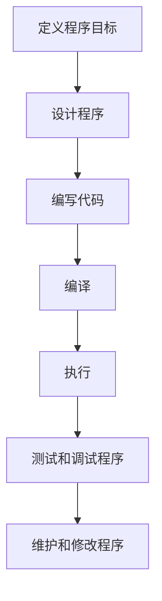

# Chapter 01 初始C语言

***---- Li Jinsheng***

***

## 一、概述

本文将存放《C Primer Plus》（第6版）第一章读书笔记

## 二、内容

### 2.1 C语言的起源

* C语言在1972年的贝尔实验室的UNIX操作系统被开发时基于B语言设计。

### 2.2 选择C语言的理由

#### 2.2.1 设计特性

C语言的特性可以让用户完成**自顶向下的规划**、**结构化编程（例：选择结构if-else、循环结构for）**和**模块化的设计**。

#### 2.2.2 高效性

C语言程序运行速度很快，且具有汇编语言才具有的**微调控能力**（*C 语言可直接通过指针操作内存地址，例如需要频繁处理大数据时，可手动控制内存分配与释放，避免不必要的内存浪费，这是 Python 等语言难以直接做到的*），可以对应调整程序获取**最大运行速度**或**最有效内存使用**。

#### 2.2.3 可移植性

* C是可移植的语言、即一种系统中编写的C程序稍作修改或不修改就能在其他系统中运行。如需修改，也只简单修改主程序**头文件**中的少许选项即可。
* UNIX系统通常将**C编译器**（C编译器是把**C语言**转换为**计算机内部指令的程序**）作为软件包的一部分，Linux亦如此。
* 提供给个人计算机的C编译器有很多种，这意味着从个人计算机、专业工作站到大型机都能找到对应的C编译器。

#### 2.2.4 强大而灵活

UNIX操作系统大部分内容是由C语言编写的。其他语言（Python、BASIC、Pascal）的许多编译器和解释器均由C语言编写的。

#### 2.2.5 灵活性

C可访问硬件、操作内存中的位，且具有丰富的运算符。没有类似C++的严格，许多任务用C语言执行都非常简洁（例如：类型转换），但可能会犯在其他语言中不会出现的错误。

#### 2.2.6 缺点

* C给予了更多的自由，同时就需要开发者承担更多的责任。特别是：**C语言使用指针**。
* C结构紧凑，结合大量的运算符。很可能会编写出让人费解的代码。

### 2.3 C语言的应用范围

* 20世纪80年代，C已经程序小型计算机（UNIX系统）使用的主流语言，后续拓展至PC和大型机。
* UNIX操作系统、PC程序、编译器、嵌入式系统等。
* 20世纪90年代，C++开始被大部分软件公司使用。C++在C语言的基础上嫁接了***面向对象编程工具***（通过对语言建模适应问题，而不是通过对问题建模适应语言）。

### 2.4 计算机能做什么

* 存储在**计算机中的内容均是数字**，计算机以数字形式存放数字和字符（每个字符都有一个数字码）。计算机载入的寄存器的指令也是数字码。
* 计算机程序必须以数字指令码（机器语言）来表示。

### 2.5 高级计算机语言和编译器

* 高级语言更注重于抽象层面表达开发者的想法，不用考虑CPU在完成任务时需要的步骤。
* 对计算机而言，高级语言时无法理解的数据。因此就需要编译器登场，其将**高级语言程序**转换为计算机能理解的**机器语言指令集程序**。
* 对不同的CPU需要使用合适的编译器与编译器集，这样一种高级语言的程序可转为供各种不同类型的CPU使用的机器语言指令集程序。

### 2.6 语言标准

1978 《The C Programming Language》第一版是公认的C标准，通常称之为 K&B C或者C经典。

#### 2.6.1 第一个ANSI/ISO C标准

* 1983年：ANSI组建一个委员会(X3J11)开发了一套标准。
* 1989年：ANSI公布该标准（ANSI C）其定义了**C语言和C标准库**。
* 1990年：ISO采用该标准（ISO C）。
* ANIS C与IOS C完全相同。ANSI/ISO C最终版本通常叫做C89或C90，业内通常使用ANSI C。

#### 2.6.2 C99标准

* 1994年ANSI/ISO开始修订C版本，最终发布了C99。
* 支持国际化编程：提供多种方式处理国际字符集。
* C99 引入了`long long`等 64 位整数类型，增强了对 64 位系统的适配性（而非直接‘支持移植’），解决了 C89 中整数类型在 64 位平台的兼容性问题
* 尽量与C90、C++兼容。

#### 2.6.3 C11标准 	

* 2007承诺发布C1X，2011发布C11。

### 2.7 使用C语言的7个步骤

#### 2.7.1 定义程序目标

* 明确自己要做什么？
* 明确需要那些信息、需要怎样的计算与控制、程序需要展示什么结果。
* 这个步骤中应该用一般术语来描述问题。

#### 2.7.2 设计程序

* 明确自己要完成什么任务后，考虑如何用程序完成它。
* 决定在程序中如何**表示数据**，以及用什么方法**处理数据**。
* 强调，应该用**一般术语来表达**，而不是用具体代码。

#### 2.7.3 编写代码

* 将设计思路转换为C语言。
* 编程过程中可添加对应注释表示思路。

#### 2.7.4 编译

* 强调：**编译取决于编程的环境**。
* **编译器作用**：将**源代码**转为**可执行代码**程序，可执行代码是用**计算机的机器语言**表示的代码。该语言由数字码表示的指令集组成。

编译器负责将C语言转为特定的机器语言。

* 编译器会执行**链接器**将源代码与C库合并成最终的程序。
* 编译器还会检查C语言程序是否有效，若发现错误则不生成可执行文件并报错。

#### 2.7.5 运行程序

* 传统上，可执行文件时可运行程序。在常见环境（Windows命令提示符模式、UNIX终端模式和Linux终端模式）中运行程序需要输入可执行文件的文件名。

#### 2.7.6 测试和调试

* 检查程序是否按照你设计的思路运行，若在执行过程中由一些错误，查找并修复错误的过程叫做调试。

#### 2.7.7 维护和修改程序

* 若发现创建程序有错，或者想拓展程序用途，这时需要修改程序。

#### 2.7.8 说明

* 编程并非像上述描述一般是一个线性的过程，很可能会遇到在调试时发现设计存在缺陷需要推倒重来的情况，或者在完成时，想到一个更好的设计思路，对程序进行**文件注释会对今后的修改提供便利**。
* 初学者通过会跳过1、2步直接进行第3步。开始还好，随着程序的庞大、复杂度的增加、**动手不动脑可不行**。程序中的错误会更加隐晦，跳过前两步往往会浪费更多的时间，因为他们所写程序通常缺少条理，让人无法理解。

### 2.8 编程机制

* C语言编写的内容被存储在文本文件中，该文件被称为**源代码文件（*sourece code file*）**。
* 大部分C系统，要求文件名以**.c**结尾。
* 在文件名中，点号（.）前面的部分称为**基础名（*base name*）**，后面的部分称为**拓展名（*extension*）**。

#### 2.8.1 目标代码文件、可执行文件和库

* C语言编程策略：将源代码转换为可执行代码文件（其中包含可直接运行的计算机机器语言）。
* 通常通过**编译**和**链接**两个步骤：编译器将**源代码**与其他**三方代码模块**转为**中间代码**，链接器将**中间代码**、**系统标准启动代码**、**库代码**合并，生成可执行文件。（这样的优势在于方便对程序进行模块化，可单独修改单个模块，不必重新编译其他模块），此外，链接器还将编写的代码与**预编译的库代码**进行合并。

* 中间文件有很多格式，这里暂时举例一种：源代码转机器代码，并把结果存放在**目标代码文件**中。虽然目标文件中包含机器语言，但并不能启动。
* 目标代码文件缺少**启动代码（*startup code*）**，其充当着程序和操作系统的接口。
* 目标代码文件缺少**库函数**。
* **链接器的作用**：将编写的**目标代码**、**系统的标准启动代码**和**库代码**合并成一个文件，即可执行文件。对于库代码，链接器只会提供程序中用到的库函数代码。

## 三、小结

本章简洁地说明了C语言的起源与其标准制定的过程，同时说明了C语言具有强大的可移植性、灵活性，多数语言所不具有的微调控能力与广泛的适用范围。重点说明了正确编程的7个步骤，强调初学者应该注意对程序定义程序目标、软件设计的重视，不可以只动手不动脑。对用C语言编写的源代码文件如何转化为可执行代码文件的过程进行了代码说明，其中编译器与链接器的作用需要重点掌握。

源代码-可执行文件的过程

* 预处理：处理代码中'#'开头的各项命令，执行头文件包含，宏定义，条件编译。
* 编译：将源代码转换为目标代码
* 链接器：将目标代码，系统中的标准启动代码和库函数合并成一个文件。